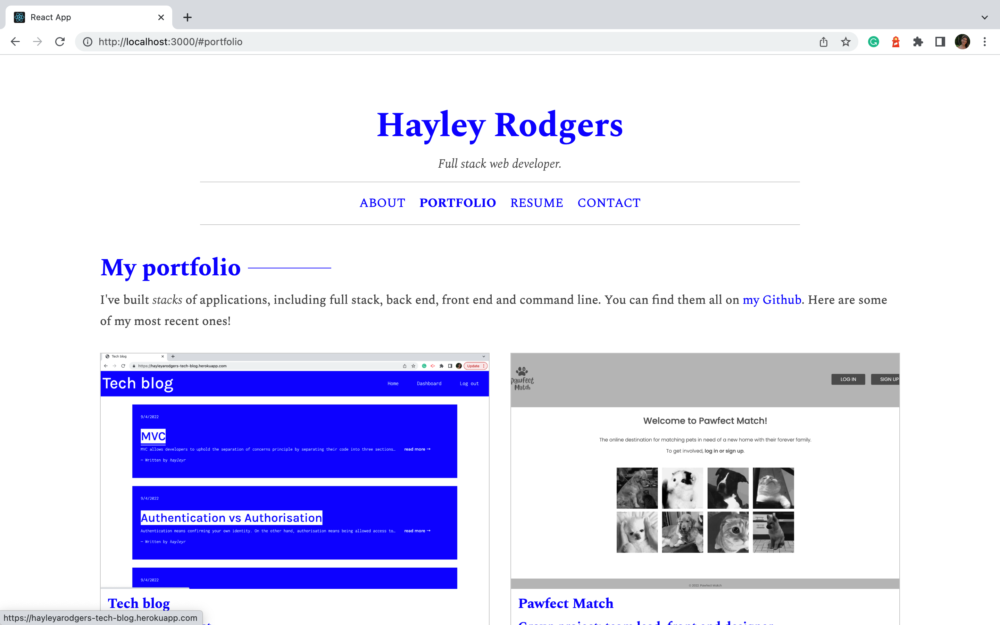

# portfolio

## Table of Contents

- [Description](#description)
- [Access](#access)

## Description

My goal for this project was to create a professional portfolio using my React skills to showcase my skills and examples of my work. This is so potential collaborators and employers can determine whether I might be a good fit for them.

### Tools and Technologies Used

To create this application, I used:

- React.js
- [create-react-app](https://github.com/facebook/create-react-app)
- And, [React Bootstrap](https://react-bootstrap.github.io/).

### Screenshot of Application

## Access

### Code Repository

The repository where the code is saved is on Github. To access it, click [here](https://github.com/hayleyarodgers/portfolio).

### Live Application

My application is deployed on GitHub pages. To access it, click [here](https://hayleyarodgers.github.io/portfolio/).
